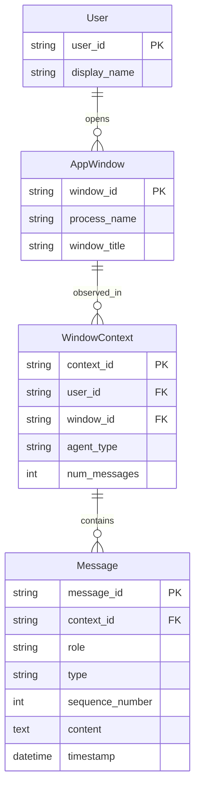

# Agno AgentSession 数据库设计 ER 图（极简版）

## 1. 概述

本文档描述了 reInput AI 输入法项目中基于 Agno 框架的极简数据库设计。该设计专注于核心功能：**窗口上下文感知和对话历史管理**，去除了所有非必要的复杂性。

## 2. 实体关系图



## 3. 核心实体说明

### 3.1 User（用户）
- **user_id** (PK): 用户唯一标识符，主键
- **display_name**: 用户显示名称

### 3.2 AppWindow（应用窗口）
- **window_id** (PK): 窗口唯一标识符，主键
- **process_name**: 进程名称（如 "chrome.exe", "Code.exe"）
- **window_title**: 窗口标题（如网页标题、文档名）

### 3.3 WindowContext（窗口上下文 = 会话）
- **context_id** (PK): 上下文唯一标识符，主键
- **user_id** (FK): 关联的用户ID，外键
- **window_id** (FK): 关联的窗口ID，外键
- **agent_type**: 智能体类型（如 "translator", "corrector", "writer"）
- **num_messages**: 该上下文中的消息数量

### 3.4 Message（消息）
- **message_id** (PK): 消息唯一标识符，主键
- **context_id** (FK): 关联的窗口上下文ID，外键
- **role**: 消息角色（如 "user", "assistant", "system"）
- **type**: 消息类型，区分用户原始输入和AI处理后的输出
  - "user_input": 用户原始输入的消息
  - "ai_output": AI处理优化后的消息
- **sequence_number**: 消息在上下文中的序号
- **content**: 消息内容
- **timestamp**: 消息时间戳

## 4. 关键设计特点

### 4.1 极简架构
- **只有4个核心实体**，数据结构清晰简洁
- **扁平化关系链**：User → AppWindow → WindowContext → Message
- **窗口即会话**：WindowContext 本身就代表一个对话会话

### 4.2 核心功能聚焦
- **窗口感知**：通过 AppWindow 捕获当前活动窗口信息
- **上下文管理**：WindowContext 基于窗口自然分组对话
- **历史记录**：Message 完整保存对话历史和时间顺序

### 4.3 智能体集成
- 通过 `agent_type` 字段标识智能体类型
- 智能体选择逻辑在应用层实现，保持数据层简洁
- 支持翻译、纠错、写作等多种智能体类型

## 5. 数据定义语言（DDL）

### 5.1 建表语句

```sql
-- 用户表
CREATE TABLE users (
    user_id TEXT PRIMARY KEY,
    display_name TEXT NOT NULL
);

-- 应用窗口表
CREATE TABLE app_windows (
    window_id TEXT PRIMARY KEY,
    process_name TEXT NOT NULL,
    window_title TEXT NOT NULL
);

-- 窗口上下文表（会话）
CREATE TABLE window_contexts (
    context_id TEXT PRIMARY KEY,
    user_id TEXT NOT NULL,
    window_id TEXT NOT NULL,
    agent_type TEXT NOT NULL,
    num_messages INTEGER DEFAULT 0,
    FOREIGN KEY (user_id) REFERENCES users(user_id),
    FOREIGN KEY (window_id) REFERENCES app_windows(window_id)
);

-- 消息表
CREATE TABLE messages (
    message_id TEXT PRIMARY KEY,
    context_id TEXT NOT NULL,
    role TEXT NOT NULL CHECK (role IN ('user', 'assistant', 'system')),
    type TEXT NOT NULL CHECK (type IN ('user_input', 'ai_output')),
    sequence_number INTEGER NOT NULL,
    content TEXT NOT NULL,
    timestamp DATETIME DEFAULT CURRENT_TIMESTAMP,
    FOREIGN KEY (context_id) REFERENCES window_contexts(context_id),
    UNIQUE(context_id, sequence_number)
);
```

### 5.2 索引优化

```sql
-- 窗口上下文查询优化
CREATE INDEX idx_window_context_user ON window_contexts(user_id);
CREATE INDEX idx_window_context_window ON window_contexts(window_id);
CREATE INDEX idx_window_context_agent_type ON window_contexts(agent_type);

-- 消息查询优化
CREATE INDEX idx_message_context ON messages(context_id);
CREATE INDEX idx_message_timestamp ON messages(timestamp DESC);
CREATE INDEX idx_message_sequence ON messages(context_id, sequence_number);
```

## 6. 应用场景

### 6.1 智能输入法核心功能
- **窗口感知**：根据当前应用窗口自动选择合适的智能体
- **上下文保持**：在同一窗口内保持对话连续性
- **历史追溯**：完整记录用户在不同应用中的交互历史

### 6.2 典型使用流程
1. 用户在 VSCode 中触发 AI 输入法
2. 系统识别窗口信息（process_name: "Code.exe"）
3. 创建或复用 WindowContext，设置 agent_type 为 "coder"
4. 用户输入保存为 Message（type: "user_input"）
5. AI 处理优化后的结果保存为 Message（type: "ai_output"）
6. 切换到浏览器时，自动创建新的 WindowContext

### 6.3 数据查询示例
```sql
-- 获取用户在特定窗口的最近对话
SELECT m.role, m.content, m.timestamp 
FROM messages m
JOIN window_contexts wc ON m.context_id = wc.context_id
JOIN app_windows aw ON wc.window_id = aw.window_id
WHERE wc.user_id = 'user123' 
  AND aw.process_name = 'chrome.exe'
ORDER BY m.timestamp DESC
LIMIT 10;

-- 统计用户使用不同智能体的频率
SELECT wc.agent_type, COUNT(*) as usage_count
FROM window_contexts wc
WHERE wc.user_id = 'user123'
GROUP BY wc.agent_type
ORDER BY usage_count DESC;
```

## 7. 设计优势

### 7.1 简洁性
- **最少实体**：只有4个核心表，易于理解和维护
- **最少字段**：每个实体只包含绝对必要的字段
- **最少关系**：线性的关系链，避免复杂的多对多关系

### 7.2 性能
- **高效查询**：扁平化结构减少 JOIN 操作
- **优化索引**：针对常用查询场景设计索引
- **轻量存储**：SQLite 本地存储，零配置部署

### 7.3 扩展性
- **agent_type 字段**：支持未来新增智能体类型
- **灵活的应用层逻辑**：复杂业务逻辑在代码中实现
- **简单的数据迁移**：结构简单，便于版本升级

## 8. 总结

这个极简设计完美实现了 reInput AI 输入法的核心需求：**记住窗口和对话历史的关系**。通过最少的实体和字段，提供了：

- ✅ 窗口上下文感知
- ✅ 完整的对话历史记录  
- ✅ 智能体类型管理
- ✅ 高性能的本地存储
- ✅ 简洁的数据结构

这种设计既满足了功能需求，又保持了系统的简洁性和可维护性，是桌面 AI 输入法应用的理想数据架构。